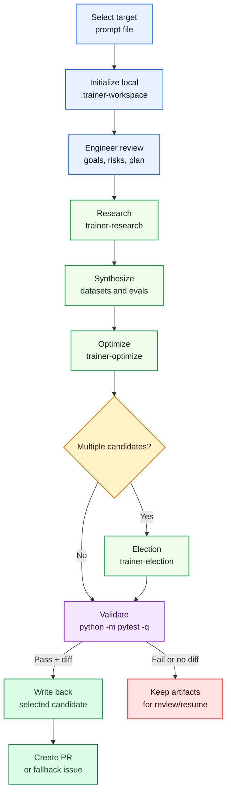

# copilot-auto-training

Reference implementation and reusable workflow for optimizing prompt-like markdown files, Agent Skills, and agent instruction files with Agent Lightning, official `evals/evals.json` manifests, and a multi-agent training loop.

## Table of Contents

- [Why use this repo](#why-use-this-repo)
- [What this repo provides](#what-this-repo-provides)
  - [Agents](#agents)
  - [Skills](#skills)
  - [Optimization loop](#optimization-loop)
- [Ways to use it](#ways-to-use-it)
- [Requirements](#requirements)
- [Installation](#installation)
- [Quick start](#quick-start)
- [Documentation](#documentation)
- [Development](#development)
- [License](#license)

## Why use this repo

Use this project when you need to:

- optimize prompts and prompt-like markdown files
- optimize Agent Skills contracts and supporting assets
- optimize agent instruction files such as `AGENTS.md`, `copilot-instructions.md`, `CLAUDE.md`, or `*.agent.md`
- run an automatic optimization loop locally, on a schedule, or through a reusable GitHub Agentic Workflow

## What this repo provides

### Agents

The repository ships a coordinated set of custom agents for prompt and skill optimization workflows.

| Agent | Role |
| --- | --- |
| `trainer` | Compatibility entrypoint for repository automation and workflow-driven optimization runs. |
| `teacher` | Canonical orchestrator for the optimization loop and stage-to-stage handoffs. |
| `student` | Drafts and revises candidate prompt or skill variants inside teacher-led loops. |
| `judge` | Scores outputs, candidates, and traces with rubric-driven evaluation. |
| `conservator` | Reviews changes against training history and repository context to avoid regressions. |
| `adversary` | Stress-tests prompts, datasets, and evaluators for failure modes before finalization. |
| `engineer` | Applies prompt-engineering, context-engineering, and Trace-oriented implementation guidance. |

### Skills

The repo exposes reusable Agent Skills for workflow authoring, prompt engineering, judging, and trainer-loop execution.

#### Workflow Authoring

| Skill | Purpose |
| --- | --- |
| [`create-workflow`](skills/create-workflow/README.md) | Create or update GitHub Agentic Workflows with `gh aw`, frontmatter, MCP setup, compilation, and validation guidance. |

#### Repository Learning

| Skill | Purpose |
| --- | --- |
| [`learn`](skills/learn/README.md) | Capture user corrections from the active conversation and update the most relevant instructions, docs, evals, or tests so the same mistake is less likely to happen again. |

#### Engineer Skills

| Skill | Purpose |
| --- | --- |
| [`engineer-prompt`](skills/engineer-prompt/README.md) | Improve prompts and context plans with the smallest effective prompt-engineering technique. |
| [`engineer-code`](skills/engineer-code/README.md) | Apply Microsoft Trace to train Python prompts, helpers, and agent components. |

#### Judge Skills

| Skill | Purpose |
| --- | --- |
| [`judge-rubric`](skills/judge-rubric/README.md) | Build formal rubrics before scoring candidates or artifacts. |
| [`judge-outcome`](skills/judge-outcome/README.md) | Compare final outputs when end-state quality is the primary evidence. |
| [`judge-trajectory`](skills/judge-trajectory/README.md) | Evaluate traces, tool usage, and side effects when process quality matters. |

#### Trainer Skills

| Skill | Purpose |
| --- | --- |
| [`trainer-research`](skills/trainer-research/README.md) | Research grounded source material, datasets, and benchmarks before synthesis. |
| [`trainer-synthesize`](skills/trainer-synthesize/README.md) | Build official eval manifests plus explicit `train.jsonl` and `val.jsonl` datasets. |
| [`trainer-optimize`](skills/trainer-optimize/README.md) | Run single-shot Agent Lightning optimization against explicit datasets. |
| [`trainer-election`](skills/trainer-election/README.md) | Elect the strongest candidate from existing scored workspace artifacts. |

### GitHub Agentic Workflows

The repository publishes a reusable `train-prompt` GitHub Agentic Workflow that selects one prompt-like file, runs the trainer loop, and opens a pull request only when validation passes and the diff is meaningful.

### Plugins

The repository also publishes a single installable Copilot CLI plugin, `copilot-training`, that bundles its skills, agents, hooks, and MCP runtime assets.

### MCP servers

#### `agent-skills`

The local MCP server under `tools/agent-skills-mcp` exposes repository skills to tool discovery so built-in agents and workflows can discover and invoke them consistently.

### Optimization loop

The optimization loop initializes a workspace, prepares an engineer review, fills any missing research or dataset gaps, runs optimization, optionally performs election, validates the result, and only then writes back the selected candidate and opens a pull request.



## Ways to use it

### 1. Use it as a GitHub Copilot local Agentic Workflow

Use the reusable workflow when another repository already stores prompt-like markdown in git and you want scheduled or manual optimization runs that produce reviewable pull requests.

Prerequisites for the target repository:

- GitHub Agentic Workflows is initialized with `gh aw init`
- `COPILOT_GITHUB_TOKEN` is configured for the chosen engine
- the repository contains prompt-like markdown files the workflow can select
- `python -m pytest -q` is the correct repository validation command, or the imported workflow is adjusted to the repository's validation command and recompiled

Install the workflow with an explicit path:

```bash
gh aw add Tyler-R-Kendrick/copilot-auto-training/.github/workflows/train-prompt.md --name train-prompt
```

If you are publishing your own fork, replace `Tyler-R-Kendrick/copilot-auto-training` with your fork's `OWNER/REPO` path in the install commands below.

Update it later with:

```bash
gh aw update train-prompt
```

The imported workflow will:

- select exactly one prompt-like file
- create or update that file's local `.trainer-workspace/<prompt-name>/`
- use packaged `trainer-research`, `trainer-synthesize`, `trainer-optimize`, and `trainer-election` skills from this repository through a bundled MCP server runtime
- open a pull request only when the optimization produced a meaningful diff and `python -m pytest -q` passed

The workflow source lives in [`.github/workflows/train-prompt.md`](.github/workflows/train-prompt.md). Frontmatter changes require recompiling it with `gh aw compile train-prompt`.

### 2. Use it as a repository template or local clone

Fork the repository or create a new repository from it when you want the whole toolchain, examples, workflows, skills, and docs in one place.

Create a project from the template with:

```bash
gh repo create <new-repo> --template Tyler-R-Kendrick/copilot-auto-training
```

For local iteration inside this repository, clone it and ask Copilot to run the trainer on a prompt-like file:

```text
run @trainer on #<prompt-name>
```

### 3. Use it as a GitHub Copilot plugin

Use the plugin marketplace when you want these skills available inside Copilot CLI without copying files by hand.

Register the marketplace:

```bash
copilot plugin marketplace add Tyler-R-Kendrick/copilot-auto-training
```

Install the published plugin:

```bash
copilot plugin install copilot-training@copilot-training
```

If you prefer a direct repository import instead of marketplace registration, install from the subdirectory path:

```bash
copilot plugin install Tyler-R-Kendrick/copilot-auto-training:plugins/copilot-training
```

The installable plugin bundles live under `plugins/`, and the marketplace manifest lives at `.github/plugin/marketplace.json`. For the full import flow, see [docs/copilot-cli-plugins.md](docs/copilot-cli-plugins.md).

### 4. Use it as a cross-repo Agentic Workflow

Use it locally as either a repo template or a locally cloned copy, then follow the GitHub Agentic Workflows cross-repository guidance to point it at the repositories you want to optimize.

## Requirements

- Python 3.11+
- dependencies from [requirements.txt](requirements.txt)
- model credentials via `OPENAI_API_KEY` or the GitHub Models variables documented in [docs/getting-started.md](docs/getting-started.md)

## Installation

```bash
python3.12 -m venv .venv
source .venv/bin/activate
python -m pip install -r requirements.txt
```

Inside the devcontainer, `.devcontainer/post-start.sh` repairs or recreates `.venv` with Python 3.12 and installs `requirements.txt` automatically when the environment is missing, stale, or broken. The Copilot coding-agent bootstrap workflow at `.github/workflows/copilot-setup-steps.yml` reuses that same script so the hosted agent gets the repository's shared setup plus `gh aw`.

## Quick start

Run the smallest example in this repository:

```bash
run @trainer on #:examples/first-run/prompts/classify_support.md   --debug-only
```

Run a small optimization pass:

```bash
run @trainer on #:examples/first-run/prompts/classify_support.md   --iterations 2   --beam-width 2   --branch-factor 2
```

For the full setup, configuration, and artifact walkthrough, start with [docs/getting-started.md](docs/getting-started.md).

## Documentation

- [docs/getting-started.md](docs/getting-started.md): installation, configuration, examples, and outputs
- [docs/copilot-cli-plugins.md](docs/copilot-cli-plugins.md): how to register this repo as a Copilot CLI marketplace and install its plugins
- [docs/dashboard.md](docs/dashboard.md): how to open and use the Agent Lightning dashboard
- [docs/troubleshooting.md](docs/troubleshooting.md): common setup, dataset, runtime, and dashboard issues
- [examples/first-run/README.md](examples/first-run/README.md): smallest runnable example in the repo
- [skills/trainer-optimize/README.md](skills/trainer-optimize/README.md): overview of the prompt optimization skill
- [skills/trainer-optimize/references/dataset-format.md](skills/trainer-optimize/references/dataset-format.md): dataset schema and scoring guidance

## Development

Key entry points:

- [skills/trainer-optimize/scripts/run_optimize.py](skills/trainer-optimize/scripts/run_optimize.py): optimization runtime
- [skills/trainer-optimize/scripts/generate_jsonl.py](skills/trainer-optimize/scripts/generate_jsonl.py): CSV-to-JSONL dataset bootstrapper
- [tests/test_run_optimize.py](tests/test_run_optimize.py): end-to-end behavior coverage

Skill layout:

- `skills/`, `.agents/skills/`, and `.claude/skills/` are the canonical in-repo skill roots.
- `plugins/copilot-training/` is the single installable Copilot CLI plugin for this repo; its `skills/`, `agents/`, `hooks/`, and `mcps/` entries symlink back to the canonical repo sources rather than copying them.
- `.agents/skills/` is the managed symlink mirror maintained by [`.github/hooks/sync-skill-links.py`](.github/hooks/sync-skill-links.py) so the repo does not keep copied skill directories.
- The helper can also link skills from `~/skills` and `~/.agents/skills` into `.agents/skills/` when those home-level roots exist.
- Local home-skill symlinks created by the watcher are ignored by [`.agents/skills/.gitignore`](.agents/skills/.gitignore) so they do not dirty the repository.
- Use `python .github/hooks/sync-skill-links.py --check` to verify that `.agents/skills/` exactly matches the discovered skill roots.
- The launcher at [`.github/hooks/ensure-skill-link-watcher.sh`](.github/hooks/ensure-skill-link-watcher.sh) performs an immediate sync and starts a background watcher so future additions to `~/skills` and `~/.agents/skills` are linked automatically during the session.
- The write-time hook in [`.github/hooks/prompt-workflow-reminder.json`](.github/hooks/prompt-workflow-reminder.json) starts that launcher automatically after file edits.

The repository currently ships official eval manifests for the trainer and engineering skills plus a smaller onboarding example under [examples/first-run](examples/first-run/README.md).

## License

This project is licensed under the terms of the [LICENSE](LICENSE) file.
