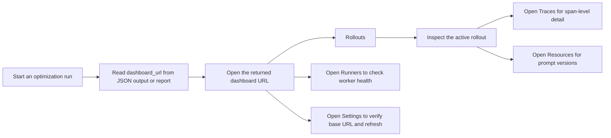

# Dashboard Guide

Agent Lightning starts a local dashboard server during active optimization runs.

## URLs

- Dashboard root: use the `dashboard_url` returned by `run_optimize.py`
- Health endpoint: `<dashboard_url>/v1/agl/health`

The dashboard is mounted at the server root rather than under `/v1/`.
Unless `AGL_SERVER_PORT` is already set, the runtime chooses a free local port on `127.0.0.1` for each run.

## Open the Dashboard

Start an optimization run in one terminal:

```bash
python skills/trainer-optimize/scripts/run_optimize.py \
  --prompt-file skills/trainer-optimize/SKILL.md
```

Read the command JSON output or report file, then open the returned `dashboard_url` from the dev container:

```bash
$BROWSER "$(jq -r '.dashboard_url' /path/to/report.json)"
```

If you are using VS Code remote development or Codespaces, you can also open the forwarded port from the browser UI. If you need a stable forwarded port, set `AGL_SERVER_PORT` before starting the run.

## Recommended Workflow



Use the dashboard in this order:

1. Open `Rollouts` to confirm the run exists and is progressing.
2. If a rollout is marked `failed`, treat that as an exception path and inspect `Traces` before describing it as a low-score result.
3. Open `Runners` if the run looks stuck and verify workers are alive.
4. Open `Resources` to inspect prompt and resource snapshots tied to the run.
5. Open `Settings` if the UI shows `Offline` and verify the backend base URL.

## Available Pages

- `Rollouts`: high-level optimization executions and attempts
- `Resources`: prompt and resource versions tracked by the run
- `Traces`: span-level execution detail for rollouts and attempts
- `Runners`: worker and runner status
- `Settings`: backend base URL, refresh interval, and theme

## Screenshot Checklist

For documentation, issues, or pull requests, these views are the most useful capture sequence:

1. `Rollouts` showing an active optimization run
2. `Resources` showing the prompt or resource versions for that run
3. `Traces` filtered to a rollout or attempt
4. `Runners` showing worker health
5. `Settings` showing the backend base URL and refresh interval

## Related Docs

- [docs/getting-started.md](getting-started.md)
- [docs/troubleshooting.md](troubleshooting.md)