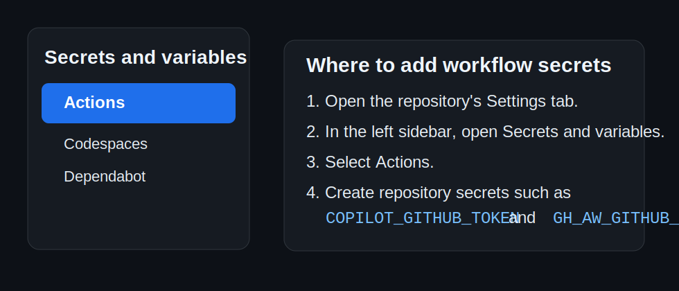
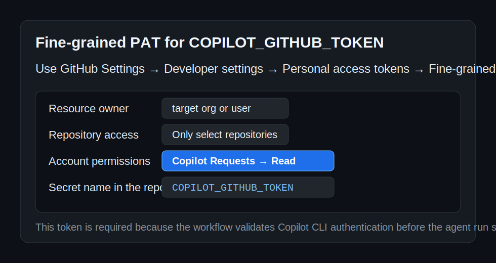
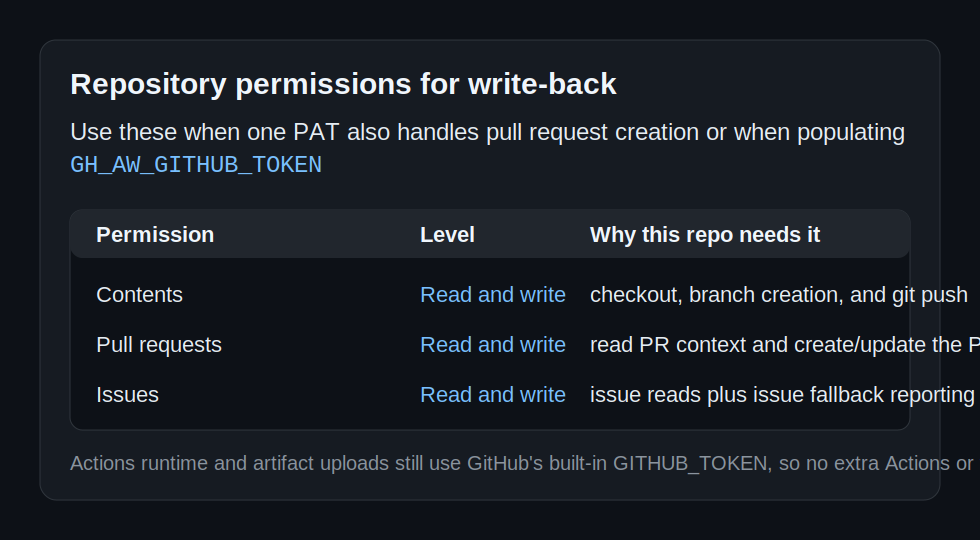
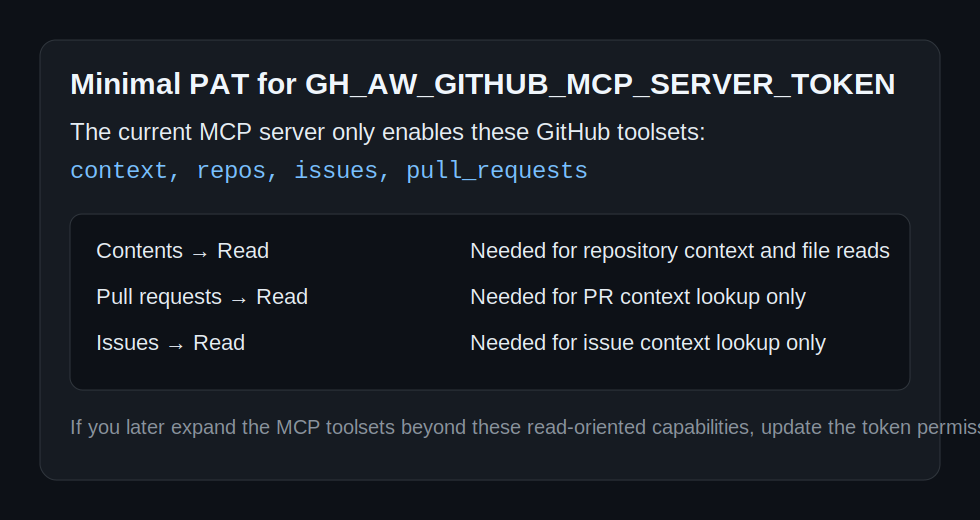

# Getting Started

This guide covers installation, model configuration, the first run, and the optimizer's output modes.

## Prerequisites

- Python 3.11 or newer
- A virtual environment for the repository
- Model credentials through either `OPENAI_API_KEY` or GitHub Models configuration in the repository root `.env`
- A model name through `OPENAI_MODEL` or `GITHUB_MODELS_MODEL`

## Install Dependencies

```bash
python3.12 -m venv .venv
source .venv/bin/activate
python -m pip install -r requirements.txt
```

The runtime dependency set includes `poml`, which Agent Lightning APO requires during optimization.

In the devcontainer, the post-start hook automatically recreates `.venv` with Python 3.12 and reinstalls dependencies when the local environment is missing, stale, or missing `pip`. The Copilot coding-agent setup workflow at `.github/workflows/copilot-setup-steps.yml` calls the same `.devcontainer/post-start.sh` bootstrap so the hosted agent reuses the repository's devcontainer setup logic, including `gh aw`.

## Configure Model Access

If you are using GitHub Models, create a repository-root `.env` file like this:

```dotenv
GITHUB_MODELS_API_KEY=<github-pat>
GITHUB_MODELS_ENDPOINT=https://models.github.ai/inference
GITHUB_MODELS_MODEL=openai/gpt-4.1-mini
GITHUB_MODELS_GRADIENT_MODEL=openai/gpt-4.1-mini
GITHUB_MODELS_APPLY_EDIT_MODEL=openai/gpt-4.1-mini
```

Start from [/.env.sample](/workspaces/copilot-apo/.env.sample) so the supported secret and model keys stay documented in one place.

When these `GITHUB_MODELS_*` values are present, the optimizer treats the repository-root `.env` as the authoritative source for GitHub Models settings.
On GitHub Models endpoints, the runtime will try the OpenAI Responses API first and automatically fall back to chat completions when the endpoint rejects that route with `404`.

## Configure GitHub Agentic Workflows Secrets

The reusable workflow in this repository currently validates `COPILOT_GITHUB_TOKEN` at startup and then uses these token chains. In the lists below, `→` means "falls back to the next token if the earlier one is unavailable":

- Copilot engine authentication: `COPILOT_GITHUB_TOKEN`
- GitHub MCP server access: `GH_AW_GITHUB_MCP_SERVER_TOKEN` → `GH_AW_GITHUB_TOKEN` → `GITHUB_TOKEN`
- Pull request write-back and safe outputs: `COPILOT_GITHUB_TOKEN` → `GH_AW_GITHUB_TOKEN` → `GITHUB_TOKEN`

That means the imported workflow requires `COPILOT_GITHUB_TOKEN`, while `GH_AW_GITHUB_TOKEN` and `GH_AW_GITHUB_MCP_SERVER_TOKEN` are optional secrets that let you split write access from read-only MCP access.

### Where to add the repository secrets

Add the secrets in **Settings** → **Secrets and variables** → **Actions**.



| Task | Minimum role | Why |
| --- | --- | --- |
| Add or update a repository Actions secret in an organization repository | Repository `write` access | GitHub only exposes repository-level Actions secrets to users who can manage repository secrets for that repo. |
| Add or update a repository Actions secret in a personal repository | Repository collaborator | The secret is stored on the repository, so the repository owner or collaborator must add it there. |
| Add or update an environment secret instead of a repository secret | Repository `admin` access | Environment secrets are managed separately from repository secrets. |
| Add or update an organization secret instead of a repository secret | Organization owner | Organization secrets are managed at the org level and can then be shared to selected repositories. |

### Secrets this repository actually uses

| Secret | Required for this repo | What uses it | Why |
| --- | --- | --- | --- |
| `COPILOT_GITHUB_TOKEN` | Yes | Workflow activation, Copilot engine, and pull request write-back | The workflow fails early if this secret is missing, because the imported workflow validates it before the agent job starts and also prefers this token when safe outputs create a pull request. |
| `GH_AW_GITHUB_TOKEN` | Optional but recommended | GitHub MCP fallback, PR branch checkout, git push, and safe outputs | Use this when you want a separate PAT for GitHub API and write-back operations instead of reusing the Copilot token for everything. |
| `GH_AW_GITHUB_MCP_SERVER_TOKEN` | Optional | GitHub MCP server only | Use this when you want the MCP server to stay read-only even if another token is allowed to create pull requests. |
| `GITHUB_TOKEN` | Built in | Final fallback for MCP and safe outputs | This keeps the workflow functional when explicit GH AW secrets are absent, but it does not replace the required `COPILOT_GITHUB_TOKEN` validation for the Copilot engine. |

### Create the fine-grained PAT for `COPILOT_GITHUB_TOKEN`

Use a **fine-grained personal access token**. Copilot CLI does not support classic `ghp_` PATs.

1. Open **Settings** → **Developer settings** → **Personal access tokens** → **Fine-grained tokens**.
2. Click **Generate new token**.
3. Choose the organization or user that owns the target repository as the **Resource owner**.
4. Limit **Repository access** to the target repository whenever possible.
5. Under **Account permissions**, add **Copilot Requests** and set it to **Read**.
6. If you plan to use the same PAT for write-back, also add the repository permissions from the table below.
7. Generate the token and save it as the repository secret `COPILOT_GITHUB_TOKEN`.



### PAT permissions: what this repository actually needs

If you want the fewest moving parts, you can use one fine-grained PAT for both `COPILOT_GITHUB_TOKEN` and `GH_AW_GITHUB_TOKEN`. If you prefer least privilege, split them into a Copilot-only PAT plus one or two GitHub API PATs.

#### Single PAT used for both Copilot and GitHub write-back

| Permission | Level | Required | Why this repo needs it |
| --- | --- | --- | --- |
| `Copilot Requests` | Account: `Read` | Yes | The workflow uses the Copilot engine and explicitly validates `COPILOT_GITHUB_TOKEN` for GitHub Copilot CLI before the run continues. |
| `Contents` | Repository: `Read and write` | Yes | The safe-output job checks out the repository with the fallback token, creates the patch branch, and pushes the branch before opening the pull request. |
| `Pull requests` | Repository: `Read and write` | Yes | The workflow reads PR context during agent execution and uses the token to create or update the pull request produced by `create-pull-request`. |
| `Issues` | Repository: `Read and write` | Yes | The workflow reads issues through the GitHub MCP toolset and can fall back to issue-based reporting in GH AW conclusion/safe-output handling. |
| `Metadata` | Repository: `Read` | Automatic | GitHub includes metadata access automatically for fine-grained PATs. |
| `Actions`, `Workflows`, `Administration`, `Secrets`, `Variables` | Repository or organization | No | This workflow uses GitHub's built-in `GITHUB_TOKEN` for Actions runtime and artifact steps. |



#### Split-token setup

| Secret | Minimal PAT permissions | Why |
| --- | --- | --- |
| `COPILOT_GITHUB_TOKEN` | `Copilot Requests: Read` | Enough for Copilot engine authentication if you do not want this token to perform repository writes. |
| `GH_AW_GITHUB_TOKEN` | `Contents: Read and write`, `Pull requests: Read and write`, `Issues: Read and write` | Enough for this repository's GitHub MCP fallback plus PR creation and issue fallback handling. |
| `GH_AW_GITHUB_MCP_SERVER_TOKEN` | `Contents: Read`, `Pull requests: Read`, `Issues: Read` | The current MCP server configuration in this repo is limited to `context`, `repos`, `issues`, and `pull_requests`, so a dedicated MCP token only needs read access unless you expand those toolsets later. |



### Roles needed for the PAT itself

| Task | Minimum role | Why |
| --- | --- | --- |
| Create the PAT | The user who owns the GitHub account | Personal access tokens are always created from a personal account. |
| Scope the PAT to an organization-owned repository | Organization member with access to the target repository | A fine-grained PAT cannot grant access the user does not already have. |
| Approve the PAT when the organization requires approval | Organization owner or the org's configured PAT approver | Some organizations keep fine-grained PATs pending until an approver reviews them. |

## Verify the Environment

Run the test suite before starting an optimization run:

```bash
python -m pytest -q
```

## Install The Copilot CLI Plugins

If you want to use the repo's skills through Copilot CLI instead of running the local Python scripts directly, add this repository as a plugin marketplace:

```bash
copilot plugin marketplace add Tyler-R-Kendrick/copilot-apo
copilot plugin install copilot-training@copilot-training
```

The repo publishes a single `copilot-training` plugin that includes the repo's skills, agents, hooks, and MCP runtime assets. For direct subdirectory installs and update commands, see [docs/copilot-cli-plugins.md](copilot-cli-plugins.md).

## First Run

The smallest runnable example in this repository is documented in [examples/first-run/README.md](../examples/first-run/README.md).

`trainer-optimize` requires explicit `--train-file` and `--val-file` inputs. It does not infer, synthesize, or collect missing datasets at runtime.

Smoke test:

```bash
python skills/trainer-optimize/scripts/run_optimize.py \
  --prompt-file examples/first-run/prompts/classify_support.md \
  --train-file examples/first-run/datasets/train.jsonl \
  --val-file examples/first-run/datasets/val.jsonl \
  --debug-only
```

Small full run:

```bash
python skills/trainer-optimize/scripts/run_optimize.py \
  --prompt-file examples/first-run/prompts/classify_support.md \
  --train-file examples/first-run/datasets/train.jsonl \
  --val-file examples/first-run/datasets/val.jsonl \
  --iterations 2 \
  --beam-width 2 \
  --branch-factor 2
```

By default, the optimized prompt is returned in JSON/stdout and the source prompt is left unchanged.
The JSON output also includes `dashboard_url`; open that value instead of assuming a fixed dashboard port.

Write to a separate file:

```bash
python skills/trainer-optimize/scripts/run_optimize.py \
  --prompt-file examples/first-run/prompts/classify_support.md \
  --train-file examples/first-run/datasets/train.jsonl \
  --val-file examples/first-run/datasets/val.jsonl \
  --output-file /tmp/optimized.md
```

Overwrite the source prompt explicitly:

```bash
python skills/trainer-optimize/scripts/run_optimize.py \
  --prompt-file examples/first-run/prompts/classify_support.md \
  --train-file examples/first-run/datasets/train.jsonl \
  --val-file examples/first-run/datasets/val.jsonl \
  --in-place
```

While the full run is active, open the `dashboard_url` returned by the command, as described in [docs/dashboard.md](dashboard.md). If you need a stable port for forwarding, set `AGL_SERVER_PORT` before starting the run.

## Using The Repository Prompt

The main project prompt is [skills/trainer-optimize/SKILL.md](../skills/trainer-optimize/SKILL.md).

Its authored eval manifest already follows the official structure:

- [skills/trainer-optimize/evals/evals.json](../skills/trainer-optimize/evals/evals.json)

When you want to run APO on the repository prompt, use explicit datasets:

```bash
python skills/trainer-optimize/scripts/run_optimize.py \
  --prompt-file skills/trainer-optimize/SKILL.md \
  --train-file skills/trainer-optimize/datasets/train.jsonl \
  --val-file skills/trainer-optimize/datasets/val.jsonl
```

You can pass options explicitly when you want to override defaults:

```bash
python skills/trainer-optimize/scripts/run_optimize.py \
  --prompt-file skills/trainer-optimize/SKILL.md \
  --train-file skills/trainer-optimize/datasets/train.jsonl \
  --val-file skills/trainer-optimize/datasets/val.jsonl \
  --algorithm apo \
  --iterations 3 \
  --judge-mode deterministic
```

## Eval Convention

Authored skill evals follow the Agent Skills article layout:

```text
<prompt-dir>/evals/evals.json
<prompt-dir>/evals/files/
<prompt-dir>/.trainer-workspace/<prompt-name>/iterations/iteration-N/
```

If you are starting from CSV input for APO, bootstrap explicit datasets with:

```bash
python skills/trainer-optimize/scripts/generate_jsonl.py \
  --prompt-file skills/trainer-optimize/SKILL.md \
  --csv-file examples.csv
```

For the full dataset contract, see [skills/trainer-optimize/references/dataset-format.md](../skills/trainer-optimize/references/dataset-format.md).

## Outputs and Artifacts

Successful optimization runs always return the optimized prompt in JSON/stdout.
Successful debug and full runs also return `dashboard_url`, which points at the active local Agent Lightning dashboard.

Optional writes:

- `--output-file` writes a separate optimized prompt file
- `--in-place` overwrites the source prompt
- `--report-file` writes a JSON report

Prompt binding notes:

- Templates that declare placeholders such as `{input}` render directly from dataset rows.
- Prompt-like files with no placeholders, including agent instruction files, now receive an implicit `Task Context:` block during rollouts so they can be optimized against explicit datasets without changing the source prompt interface.
- `--debug-only` runs a live smoke rollout against the first training row without instantiating APO or VERL, which makes it useful for validating prompt, dataset, and model wiring separately from full optimization.

For authored skill evaluation, the key file is:

- [skills/trainer-optimize/evals/evals.json](../skills/trainer-optimize/evals/evals.json)

The optimizer no longer writes prompt content or reports unless you explicitly request those outputs.

## Interpreting Failed Rollouts

In the Agent Lightning dashboard, a rollout with `status: failed` means the worker hit an exception path. It does not mean the prompt merely earned a `0.0` score.

Check these in order:

1. CLI stderr or any saved `optimize-stderr.txt` for the actual exception.
2. `Traces` in the dashboard for attempt-level detail.
3. Placeholder compatibility between the prompt and dataset.
4. The current `dashboard_url` or `AGL_SERVER_PORT` if the UI is connected to an old server.

## Trace Training

To tune the optimize runtime itself with Microsoft Trace, run the helper on one or more explicit prompt cases:

```bash
python skills/trainer-optimize/scripts/train.py \
  --prompt-file examples/first-run/prompts/classify_support.md \
  --train-file examples/first-run/datasets/train.jsonl \
  --val-file examples/first-run/datasets/val.jsonl \
  --epochs 2 \
  --report-file /tmp/trace-train-report.json
```

The Trace helper keeps `trainer-optimize` single-shot. It tunes the policy that selects optimize settings and writes a JSON training report only when you request `--report-file`.

## Next Reading

- [docs/dashboard.md](dashboard.md)
- [docs/troubleshooting.md](troubleshooting.md)
- [examples/first-run/README.md](../examples/first-run/README.md)
